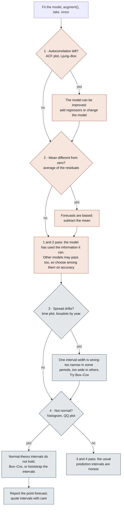

# Time series residual diagnostics

*A one-page summary for Session 9 and Group Assignment 2. The handwritten original is
[`09_A_ResidualsDiagnostics_Summary.pdf`](09_A_ResidualsDiagnostics_Summary.pdf) in this folder.
Prof. Juan Garbayo de Pablo and Prof. Alejandro Berrizbeitia.*

All four properties are about the **innovation residuals**, the `.innov` column from `augment()`.
With no transformation (and additive errors) they are identical to `.resid`.

$$e_t = y_t - \hat{y}_{t|t-1}$$

---

## The four properties

| | Property | In symbols | The question it answers |
|---|---|---|---|
| **1** | Uncorrelated | $\operatorname{cov}(e_t,\, e_{t-s}) = 0$ for every lag $s \neq 0$ | Is there information left in the residuals? |
| **2** | Zero mean | $E[e_t] = 0$ | Are the forecasts biased? |
| **3** | Constant variance (homoscedasticity) | $\operatorname{var}(e_t) = \sigma^2$ for every $t$ | Can one interval width be used everywhere? |
| **4** | Normally distributed | $e_t \sim N(0, \sigma^2)$ | Does the interval arithmetic hold? |

- **1 and 2 are about the model.** If the residuals fail either, the model can be improved.
- **3 and 4 are about the prediction intervals.** They are useful but not necessary: if the residuals
  fail them, the point forecasts are unaffected, but the intervals take more work to compute
  honestly.

Why property 2 means unbiased forecasts: since $e_t = y_t - \hat{y}_t$, linearity of expectation
gives $E[e_t] = E[y_t] - E[\hat{y}_t]$, so $E[e_t] = 0 \iff E[y_t] = E[\hat{y}_t]$.

---

## Check and fix

| | How to check | If it fails |
|---|---|---|
| **1** Uncorrelated | ACF plot; Ljung–Box test (or Box–Pierce) on the first `lag` autocorrelations | **Harder.** Add regressors, or change the model |
| **2** Zero mean | The average of the residuals; formally, a t-test on the mean | **Easy.** Subtract the residual mean from the forecasts |
| **3** Constant variance | Time plot of the residuals; boxplots by year | Box–Cox transformation (Session 11); change the model |
| **4** Normal | Histogram (or kernel density); QQ plot; boxplots for symmetry | Box–Cox transformation; bootstrapped intervals, which do not assume normality; change the model |

`gg_tsresiduals()` draws the time plot, the ACF plot and the histogram in one call.
`features(.innov, ljung_box, lag = , dof = )` runs the Ljung–Box test: a small p-value means
structure is left.

Formal tests beyond this course, for reference: Breusch–Pagan and McLeod–Li for constant
variance; Shapiro–Wilk, D'Agostino and Jarque–Bera for normality.

---

## The decision flow

Check all four every time. A failure tells you what to do next; it never means the diagnosis stops.

---

## The two conclusions

- **If the residuals fail 1 or 2**, the model can be improved.
- **If they pass 1 and 2**, it may still be possible to improve the model. Several models can pass,
  and you need to choose among them (Sessions 13 and 14).
- **If they fail 3 or 4**, the point forecast is unaffected, but the prediction intervals need more
  work and should be quoted with care.
